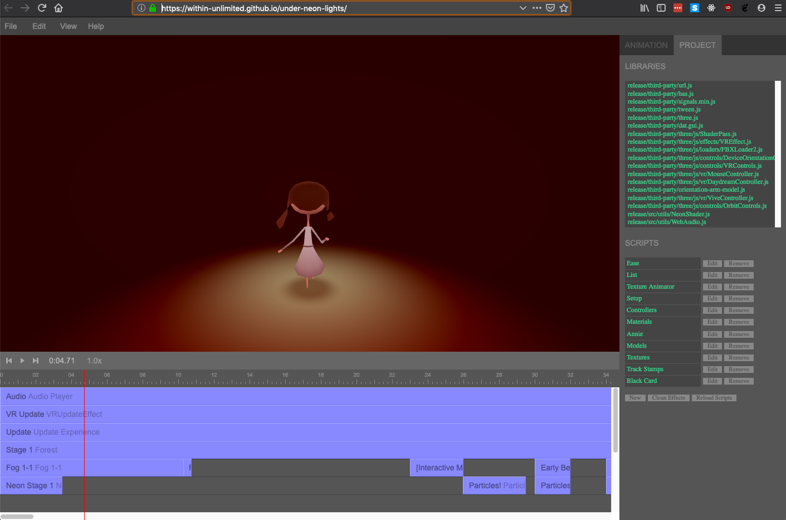
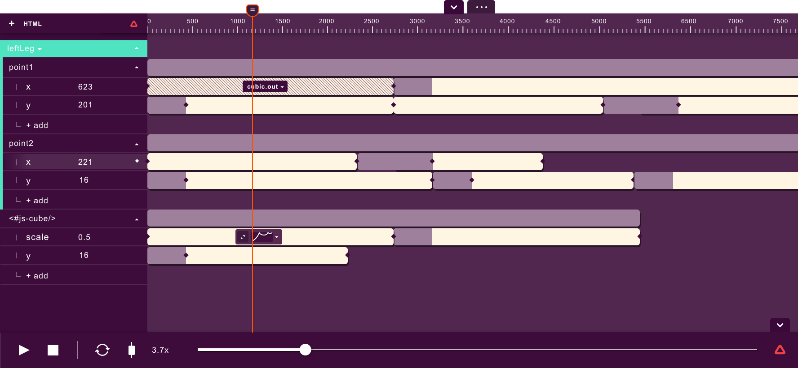
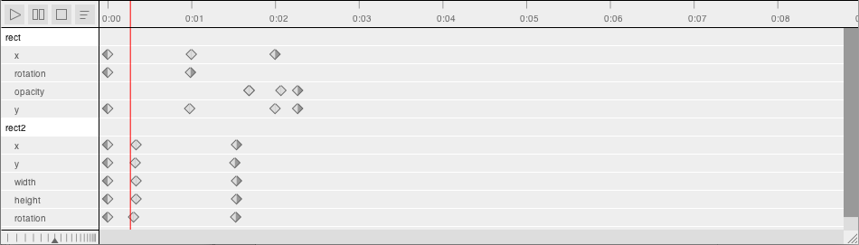

# Muti-Purpose JS Timeline

## Motivation

Timelines are prominent in experience "design" applications such as [D3 Designer](https://www.disguise.one/en/products/designer/), but also in other familiar tools such as After Effects, editing software and of course Flash. In audio work they are common too, especially in [DAWs](https://en.wikipedia.org/wiki/Digital_audio_workstation).

“mrdoob” of ThreeJS fame has even built a timeline editor in JS (https://github.com/mrdoob/frame.js/) that uses ThreeJS and can even do VR sequences, e.g. https://within-unlimited.github.io/under-neon-lights/ (“Under Neon Lights” music video for St Vincent)

Other examples exist but much stronger on the “layers with keyframing” model than than the “clips on layers” functionality, e.g. https://github.com/mojs/mojs-timeline-editor (tied to mojs framework)...

 ...and https://www.npmjs.com/package/timeline-js 

### What's missing?

Some aspects of what we need are found in the above examples, but ideally we need a timeline with the following features in common:

* "Block" or clip type editing (multiple per layer) **AND** keyframe editors (the blocks should move their associated keyframes with them)
* Nested timelines

## Features Roadmap
- [x] Layers provide concurrent blocks to be arranged
- [x] Blocks should be movable (update start position)
- [ ] Blocks should be resizable
- [ ] Blocks should be able to insert (shift later blocks)
- [ ] Timeline should be zoomable
- [x] Timeline should be playable, i.e. a playhead starts moving
- [ ] Timeline should update a POJO
- [ ] Timeline should emit events over a standardised websocket protocol
- [ ] Timelines should be nestable

## Installing, running, deploying

This project was bootstrapped with [Create React App](https://github.com/facebook/create-react-app). Documentation about building and running [here](./docs/CreateReactApp.md)

