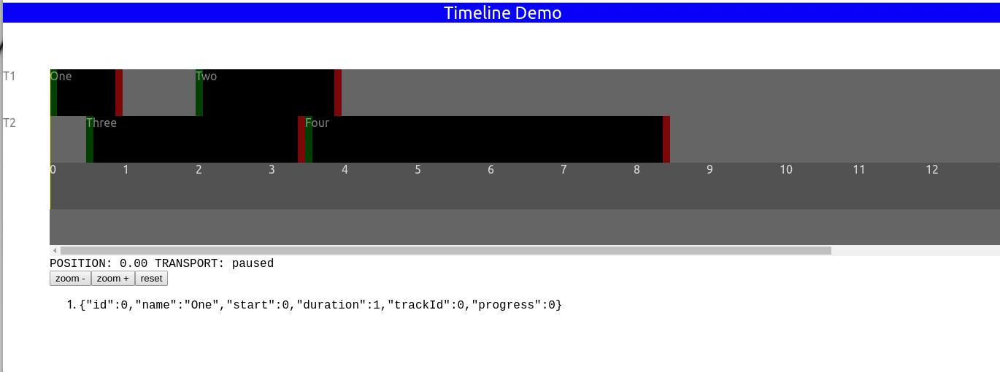

# Muti-Purpose JS Timeline

***WARNING: THIS IS A PROOF-OF-CONCEPT PROJECT AND NOT YET READY FOR PRODUCTION USE***

## Current state
Screenshot of the current state of the interface:

(GIF created with handy ffmpeg command: `ffmpeg -i Kazam_screencast_00001.mp4 -filter_complex "[0:v] split [a][b];[a] palettegen [p];[b][p] paletteuse" current-state.gif`)

## Tech
Currently using:
* react
* TypeScript

## Design

Hierarchy of elements:
* Each *Timeline* has one or more
    * *Track(s)* which has one or more
       * *Block(s)* which may have zero, one or more
           * *Keyframe layers* with one or more
               * *Keyframe(s)*

## Features Roadmap

Basic functionality is mostly done, but there's a lot of work to be done in adding:

* Keyframe visualisation and editing
* Nested timelines
* Advanced editing features (insert, etc.)

See the full scope of work in progress (and jump in!) at https://github.com/RandomStudio/IdealTimeline/projects

## Installing, running, deploying

This project was bootstrapped with [Create React App](https://github.com/facebook/create-react-app). Documentation about building and running [here](./docs/CreateReactApp.md)

## Motivation

Timelines are prominent in experience "design" applications such as [D3 Designer](https://www.disguise.one/en/products/designer/), but also in other familiar tools such as After Effects, editing software and of course Flash. Timelines are a key component of virtually every video editing program (although the name "non-linear editor" is a confusing designation, since the result is very much linear). In audio work they are common too, especially in [DAWs](https://en.wikipedia.org/wiki/Digital_audio_workstation).

“mrdoob” of ThreeJS fame has even built a timeline editor in JS (https://github.com/mrdoob/frame.js/) that uses ThreeJS and can even do VR sequences, e.g. https://within-unlimited.github.io/under-neon-lights/ (“Under Neon Lights” music video for St Vincent)

Other examples exist but tend to lean much more strongly on the “layers with keyframing” model (à la After Effects) than than the “clips on layers” functionality (see video editors such as Premiere Pro). For example, here is https://github.com/mojs/mojs-timeline-editor (tied to mojs framework)...

 ...and https://www.npmjs.com/package/timeline-js 

### What's missing?

Some aspects of what we need are found in the above examples, but ideally we need a timeline with the following features in common:

* "Block" or clip type editing (multiple per layer) **AND** keyframe editors (the blocks should move their associated keyframes with them)
* Nested timelines

